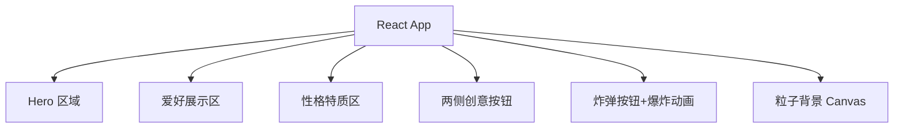

## 1. 架构设计

## 2. 技术说明
- 前端：React@18 + TailwindCSS@3 + Vite
- 初始化工具：vite-init
- 动画：CSS 动画 + JS 粒子系统 + 原生 DOM 操作实现爆炸效果
- 无后端

## 3. 路由定义
| 路由 | 用途 |
|------|------|
| / | 首页唯一路由 |

## 4. 数据模型
无后端，纯静态数据
